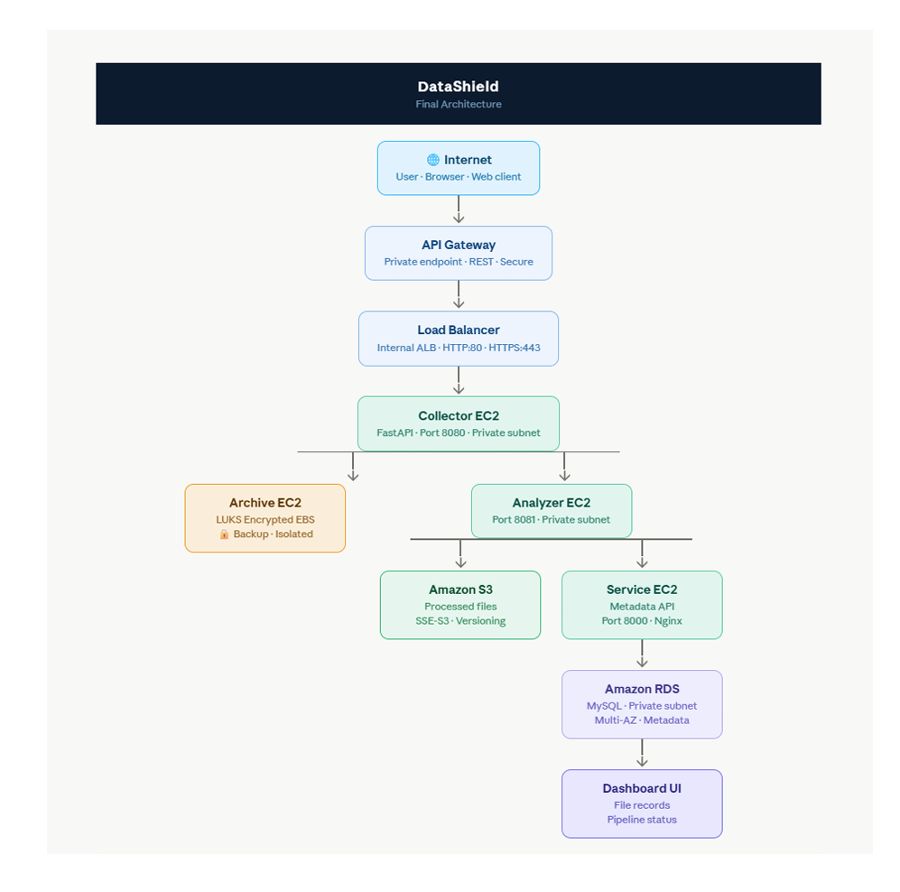

# 🛡️ DataShield

## Secure Cloud-Native Data Processing and Archival Platform on AWS

DataShield is a cloud-native data processing and archival platform built on Amazon Web Services (AWS). It demonstrates the design and deployment of a secure, scalable, and highly available multi-tier architecture that collects incoming data, creates encrypted backups, processes data, stores processed outputs in Amazon S3, maintains metadata in Amazon RDS, and monitors infrastructure using AWS services.

---
## Project Overview

DataShield was developed to demonstrate real-world cloud architecture, Linux administration, networking, storage management, monitoring, and automation using AWS.

The platform follows a microservice-based architecture where each service has a dedicated responsibility.

The complete data flow is:

Client
→ API Gateway
→ VPC Link
→ Application Load Balancer
→ Collector Service
→ Archive Server (Raw Backup)
→ Analyzer Service
→ Amazon S3
→ Service Layer
→ Amazon RDS
→ Dashboard

The project was designed with security, scalability, maintainability, and fault tolerance as primary objectives.

## Table of Contents

- Project Overview
- Problem Statement
- Objectives
- Architecture
- Data Flow
- Technology Stack
- AWS Services Used
- Linux Components
- Project Structure
- Deployment Guide
- Testing
- Screenshots
- Challenges Faced
- Future Improvements
- Conclusion

## Problem Statement

Organizations generate large volumes of application data that must be securely collected, processed, archived, and monitored. Traditional single-server architectures introduce challenges such as limited scalability, lack of redundancy, security risks, and poor maintainability.

The objective of DataShield is to design a secure cloud-native platform that separates responsibilities across multiple services while providing encrypted storage, centralized metadata management, monitoring, and high availability.

## Project Objectives

- Design a secure multi-tier AWS architecture.
- Collect application data through REST APIs.
- Archive raw data using encrypted storage.
- Process incoming data using dedicated services.
- Store processed files in Amazon S3.
- Maintain metadata using Amazon RDS.
- Monitor infrastructure using CloudWatch.
- Generate alerts using Amazon SNS.
- Implement high availability using Auto Scaling and Application Load Balancer.
- Apply AWS security best practices.

## 🏗️ System Architecture

DataShield follows a secure multi-tier cloud architecture deployed within an Amazon Virtual Private Cloud (VPC). The application is divided into multiple independent services, each responsible for a specific task in the data processing pipeline. This design improves scalability, security, fault isolation, and maintainability.

## 📐 Architecture Diagram

The following diagram illustrates the complete DataShield architecture.

  

*Figure 1: High-Level DataShield AWS Architecture*

📖 **Read the complete architecture explanation:**
- [Architecture Documentation](docs/02-Architecture.md)

## 🔄 End-to-End Data Flow

The complete request lifecycle is illustrated below:

Client
↓
Amazon API Gateway
↓
VPC Link
↓
Application Load Balancer
↓
Collector Service (EC2)
↓
Archive Server (NFS + LUKS Encrypted Storage)
↓
Analyzer Service (EC2)
↓
Amazon S3
↓
Service Layer (EC2)
↓
Amazon RDS
↓
Dashboard

## 🚀 Request Flow

1. Client sends a JSON request.
2. API Gateway receives the request.
3. VPC Link forwards traffic to the ALB.
4. ALB routes the request to the Collector Service.
5. Collector creates a raw backup.
6. Raw backup is stored on the Archive Server through NFS.
7. Collector forwards the request to the Analyzer Service.
8. Analyzer processes the request.
9. Processed output is uploaded to Amazon S3.
10. Analyzer sends metadata to the Service Layer.
11. Service Layer stores metadata in Amazon RDS.
12. Dashboard retrieves metadata for visualization.

## 🛠️ Technology Stack

### Programming Languages

| Technology | Purpose |
|------------|---------|
| Python 3.9 | Backend application development |
| Bash | Linux automation and administration |
| SQL | Metadata storage and retrieval |

---

### Frameworks

| Framework | Purpose |
|-----------|---------|
| FastAPI | REST API development |
| Uvicorn | ASGI application server |

---

### Database

| Technology | Purpose |
|------------|---------|
| Amazon RDS (MySQL) | Stores processed file metadata |

---

### Storage

| Technology | Purpose |
|------------|---------|
| Amazon S3 | Stores processed JSON files |
| Amazon EBS | Persistent block storage |
| LUKS | Encrypts archive storage |
| NFS | Shared storage between Collector and Archive |

---

### AWS Services

| Service | Purpose |
|---------|---------|
| Amazon EC2 | Hosts application services |
| Amazon VPC | Private cloud networking |
| Internet Gateway | Internet access for public subnet |
| NAT Gateway | Internet access for private subnet instances |
| Security Groups | Stateful firewall protection |
| IAM | Identity and access management |
| Amazon API Gateway | Public API endpoint |
| VPC Link | Connects API Gateway to private resources |
| Application Load Balancer | Distributes incoming traffic |
| Auto Scaling Group | Maintains high availability |
| Launch Template | Defines EC2 launch configuration |
| Amazon S3 | Object storage |
| Amazon RDS | Metadata database |
| Amazon CloudWatch | Monitoring and metrics |
| Amazon SNS | Email notifications |

## ☁ AWS Infrastructure

> 📁 **Detailed AWS implementation documentation**

| Documentation | Description |
|--------------|-------------|
| 🚀 **[AWS Infrastructure Guide](aws/README.md)** 
| Complete documentation of all AWS services used in the DataShield project |

---

### Linux Technologies

| Technology | Purpose |
|------------|---------|
| systemd | Service management |
| NFS | Shared file system |
| LUKS | Disk encryption |
| SSH | Secure remote access |
| Cron | Task scheduling (if used) |
| Mount | File system mounting |
| journalctl | Log monitoring |

---

### Development Tools

| Tool | Purpose |
|------|---------|
| Git | Version control |
| GitHub | Source code management |
| VS Code | Development environment |
| Postman / Curl | API testing |

## ✨ Features

- Secure multi-tier cloud architecture
- REST APIs using FastAPI
- API Gateway integration
- Application Load Balancer
- Auto Scaling support
- Secure private networking
- Encrypted archive storage using LUKS
- Shared storage using NFS
- Processed file storage using Amazon S3
- Metadata storage using Amazon RDS
- IAM role-based authentication
- Infrastructure monitoring using CloudWatch
- Email notifications using Amazon SNS
- End-to-end data processing pipeline
- Health check endpoints for application services

## 🔒 Security Features

- IAM Role-based authentication (no hardcoded AWS credentials)
- Backend services deployed in private subnets
- Public access restricted through API Gateway and ALB
- Security Groups used as stateful firewalls
- LUKS encryption for archive storage
- Private communication between services
- Metadata stored securely in Amazon RDS
- Controlled internet access through NAT Gateway
- Encrypted communication within AWS VPC.  

## 🚀 Deployment

DataShield can be deployed on AWS using Amazon EC2, VPC, API Gateway, ALB, S3, RDS, and CloudWatch.

📖 Detailed deployment instructions:

➡️ [Deployment Guide](docs/06-Deployment-Guide.md)

## 📡 API Documentation

### Collector Service

| Method | Endpoint | Description |
|---------|----------|-------------|
| GET | / | Collector Status |
| GET | /health | Health Check |
| POST | /collect | Process Incoming Request |
| POST | /private/collect | API Gateway Endpoint |

---

### Analyzer Service

| Method | Endpoint | Description |
|---------|----------|-------------|
| GET | /health | Health Check |
| POST | /analyze | Process Incoming Data |

---

### Service Layer

| Method | Endpoint | Description |
|---------|----------|-------------|
| GET | / | Dashboard |
| GET | /health | Health Check |
| POST | /metadata | Store Metadata |
| GET | /files | View Stored Metadata |

## 🧪 Testing

The DataShield platform was validated through end-to-end functional testing to ensure each component operated correctly both individually and as part of the complete data processing pipeline.

### Validation Summary

- ✅ Collector Service
- ✅ Analyzer Service
- ✅ Archive (NFS + LUKS)
- ✅ Amazon S3 Upload
- ✅ Amazon RDS Metadata Storage
- ✅ API Gateway
- ✅ Application Load Balancer
- ✅ Auto Scaling
- ✅ CloudWatch Monitoring
- ✅ SNS Notifications

📖 **Detailed testing procedures, commands, expected outputs, and screenshots are available here:**

➡️ [Testing Documentation](docs/07-Testing.md)

## 🚀 Future Improvements

- Infrastructure as Code using Terraform.
- CI/CD pipeline using GitHub Actions.
- Docker containerization.
- Kubernetes deployment using Amazon EKS.
- AWS Secrets Manager for database credentials.
- AWS WAF for API protection.
- Multi-AZ RDS deployment.
- AWS Backup integration.
- CloudFront integration.
- AWS X-Ray for distributed tracing.

## ✅ Conclusion

DataShield demonstrates the implementation of a secure, scalable, and cloud-native data processing platform using Amazon Web Services. The project combines AWS networking, Linux administration, encrypted storage, monitoring, and modern REST API development to simulate a production-grade architecture.

The project provided hands-on experience in designing secure cloud infrastructure, deploying distributed services, implementing storage encryption, configuring monitoring solutions, and integrating multiple AWS services into a complete end-to-end solution.

# Security Policy

This project is intended for educational and portfolio purposes.

Do not commit:

- AWS Access Keys
- IAM Credentials
- .env files
- Private Keys
- Database Passwords

If you discover a security issue, please contact the repository owner.
