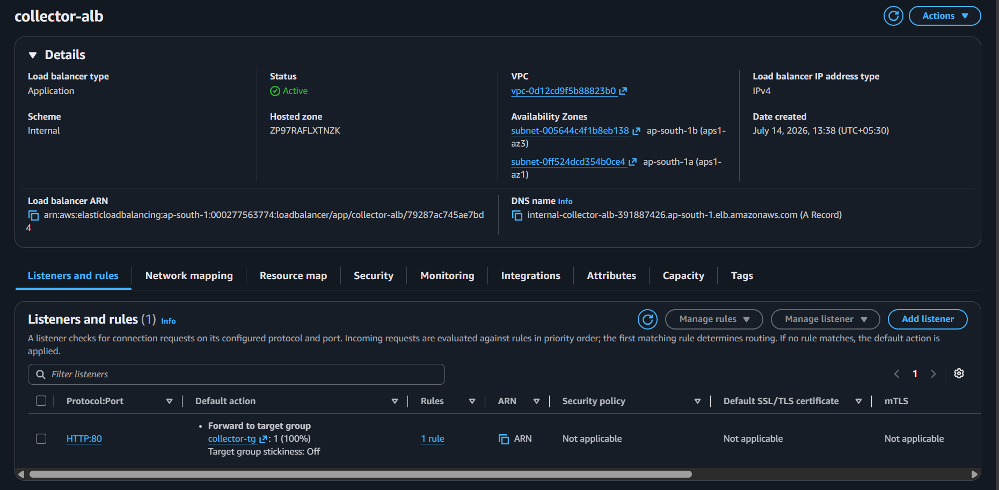
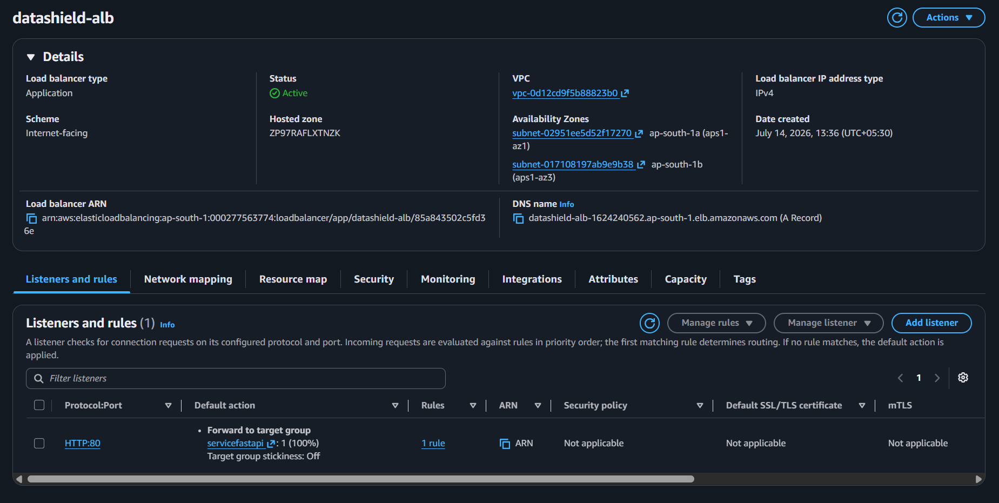

# Application Load Balancer (ALB)

## Overview

The Application Load Balancer (ALB) is an AWS Layer 7 (Application Layer) load balancer that distributes incoming HTTP/HTTPS requests across multiple EC2 instances. In the DataShield platform, the ALB acts as the entry point for application traffic and forwards requests to healthy Collector instances.

---

# Purpose in DataShield

The Application Load Balancer was implemented to:

- Distribute incoming client requests
- Improve application availability
- Support Auto Scaling
- Perform health checks
- Eliminate single points of failure
- Route traffic only to healthy Collector instances

---

# Why Application Load Balancer?

The ALB was selected because it provides:

- Layer 7 (HTTP/HTTPS) routing
- Health checks
- High availability
- Integration with Auto Scaling Groups
- Host and path-based routing
- Better scalability than directly exposing EC2

Instead of exposing the Collector EC2 instance directly to the internet, all client requests first pass through the ALB.

---

# Architecture

```
Internet
      │
      ▼
Application Load Balancer
      │
      ▼
Target Group
      │
      ▼
Collector EC2 Instances
```

---

# Request Flow

```
Client

↓

Application Load Balancer

↓

Target Group

↓

Healthy Collector EC2

↓

Analyzer

↓

Amazon S3

↓

Lambda

↓

Amazon RDS
```

---

# Listener Configuration

| Protocol | Port | Action |
|----------|------|--------|
| HTTP | 80 | Forward to Collector Target Group |
| HTTPS *(Optional)* | 443 | Forward to Collector Target Group |

---

# Target Group

The Target Group contains all healthy Collector EC2 instances.

Health checks ensure that traffic is forwarded only to healthy instances.

Health Check Configuration

| Property | Value |
|----------|-------|
| Protocol | HTTP |
| Port | 8080 |
| Health Check Path | /health |
| Healthy Threshold | Default |
| Unhealthy Threshold | Default |

---

# Integration with Auto Scaling

The ALB is attached to the Collector Auto Scaling Group.

When Auto Scaling launches a new Collector instance:

1. Instance starts
2. Collector Service starts
3. Health Check passes
4. Instance becomes Healthy
5. ALB starts forwarding requests

If an instance fails the health check:

- It is marked Unhealthy
- No traffic is forwarded
- Auto Scaling launches a replacement instance

---

# Security

The Application Load Balancer is deployed inside the public subnet.

Security Features:

- Security Group protection
- HTTP/HTTPS listeners
- Health monitoring
- Backend instances remain private
- Only ALB communicates with Collector

---

# Benefits

- High Availability
- Fault Tolerance
- Automatic Load Distribution
- Health Checks
- Auto Scaling Integration
- Reduced Downtime
- Better User Experience

---

# Screenshots

## ALB Overview



---

## PUBLIC ALB



---

# Why ALB Instead of Direct EC2?

Without ALB

```
Internet

↓

Collector EC2
```

Problems

- Single point of failure
- No load balancing
- No health checks
- Poor scalability

With ALB

```
Internet

↓

Application Load Balancer

↓

Multiple Collector EC2 Instances
```

Advantages

- High Availability
- Scalability
- Fault Tolerance
- Better Reliability

---

# Key Takeaways

The Application Load Balancer provides a scalable and highly available entry point for the DataShield platform. By distributing incoming requests across healthy Collector instances and integrating with Auto Scaling Groups, the ALB improves application reliability, fault tolerance, and overall system performance while keeping backend resources secure within private subnets.