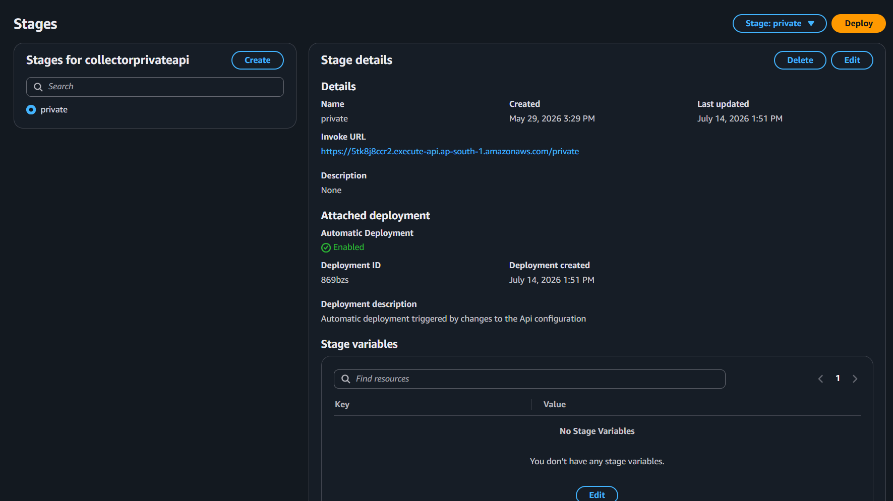
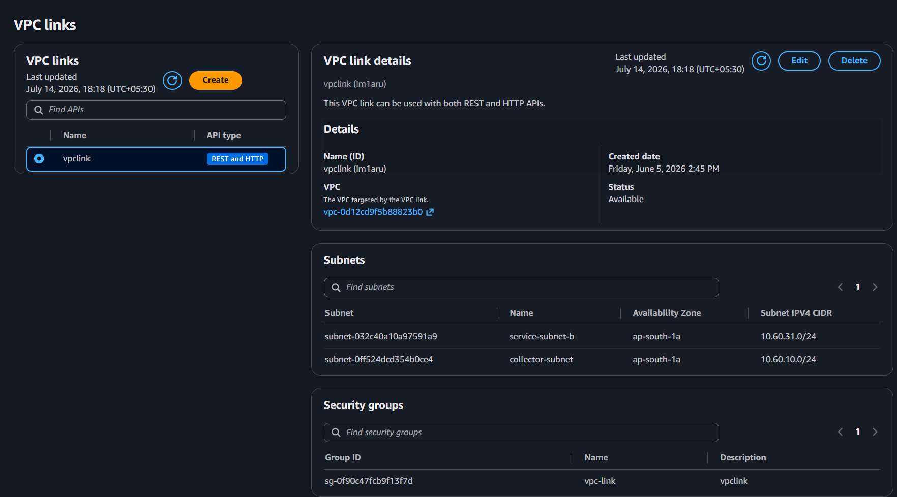
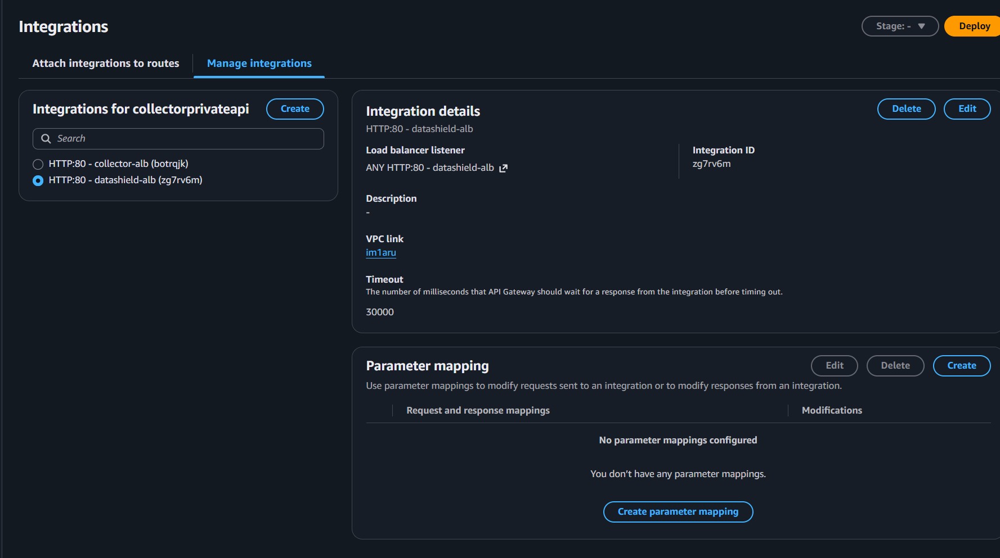

# Amazon API Gateway

## Overview

Amazon API Gateway is a fully managed AWS service used to create, publish, secure, and manage REST APIs. In the DataShield platform, API Gateway acts as the public entry point for client requests and securely forwards them to backend services running inside a private Amazon VPC through a VPC Link and an Application Load Balancer.

---

# Purpose in DataShield

API Gateway was implemented to:

- Provide a single public endpoint
- Securely expose backend APIs
- Route client requests to the Collector Service
- Integrate with private AWS resources
- Improve scalability and maintainability
- Support future authentication and rate limiting

---

# Why API Gateway?

Instead of exposing EC2 instances directly to the internet, API Gateway provides:

- Secure public endpoint
- Request routing
- Integration with private VPC resources
- Better API management
- Monitoring
- Scalability

---

# Architecture

```
Client
    │
    ▼
API Gateway
    │
    ▼
VPC Link
    │
    ▼
Application Load Balancer
    │
    ▼
Collector EC2
    │
    ▼
Analyzer EC2
    │
    ▼
Amazon S3
    │
    ▼
AWS Lambda
    │
    ▼
Amazon RDS
```

---

# Request Flow

### Step 1

Client sends HTTP request.

↓

### Step 2

API Gateway receives the request.

↓

### Step 3

API Gateway forwards the request through the VPC Link.

↓

### Step 4

The VPC Link securely connects to the internal Application Load Balancer.

↓

### Step 5

The ALB forwards the request to a healthy Collector EC2 instance.

↓

### Step 6

Collector creates a raw backup and forwards the request to the Analyzer.

↓

### Step 7

Analyzer processes the data and uploads the output to Amazon S3.

↓

### Step 8

Amazon S3 triggers AWS Lambda.

↓

### Step 9

Lambda extracts metadata and stores it in Amazon RDS.

---

# VPC Link

## Why VPC Link?

API Gateway is outside the VPC.

Collector EC2 is inside a private subnet.

Since private EC2 instances cannot be accessed directly, a VPC Link provides a secure connection between API Gateway and the internal Application Load Balancer.

### Benefits

- Secure backend communication
- No public EC2 instances
- High availability
- Native AWS integration

---

# API Configuration

| Property | Value |
|----------|-------|
| API Type | REST API |
| Endpoint Type | Regional |
| Integration | VPC Link |
| Backend | Application Load Balancer |

*(Update these values if your configuration differs.)*

---

# Security

Security measures implemented:

- API Gateway is the only public endpoint
- Backend EC2 instances remain private
- Communication through VPC Link
- Security Groups protect backend resources
- ALB distributes requests only to healthy instances

---

# Advantages

- Secure API access
- Centralized API management
- Private backend infrastructure
- High availability
- Easy integration with AWS services
- Future support for authentication, throttling, and custom domains

---

# Screenshots

## Stage



---

## VPC Link



---

## Integration



---

# Why API Gateway Instead of Public EC2?

Without API Gateway

```
Internet

↓

Collector EC2
```

Problems

- EC2 publicly exposed
- Difficult to manage APIs
- Limited scalability
- Reduced security

With API Gateway

```
Internet

↓

API Gateway

↓

VPC Link

↓

ALB

↓

Collector EC2
```

Advantages

- Better security
- Centralized API management
- High availability
- Easy scaling
- Private backend architecture

---

# Key Takeaways

Amazon API Gateway provides the secure public entry point for the DataShield platform. By integrating with a VPC Link and Application Load Balancer, it enables external clients to access private backend services without exposing EC2 instances directly to the internet. This architecture improves security, scalability, and operational flexibility.