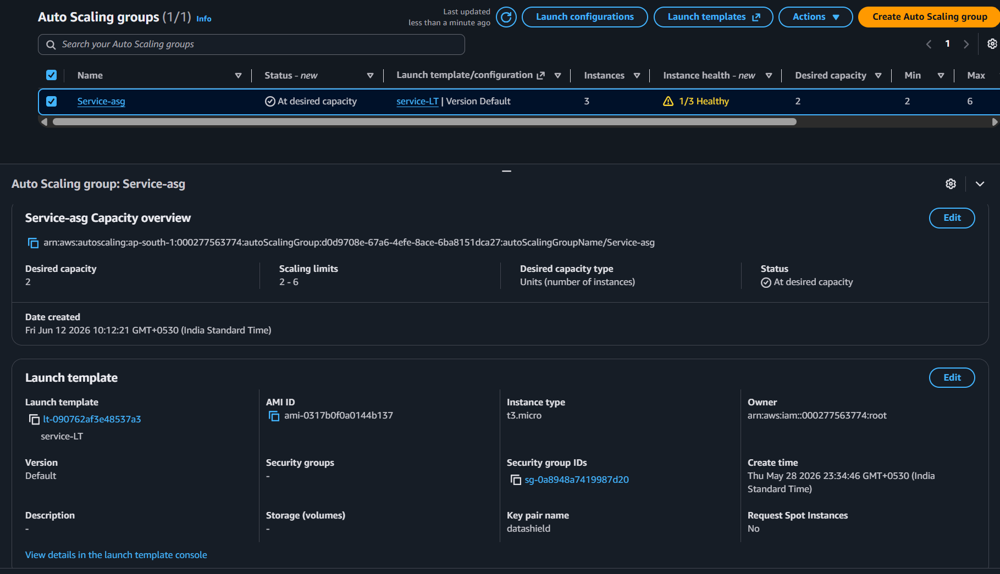
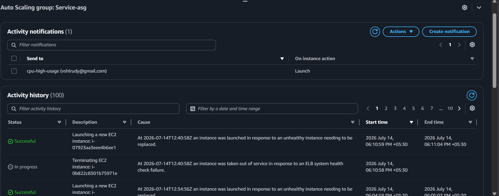
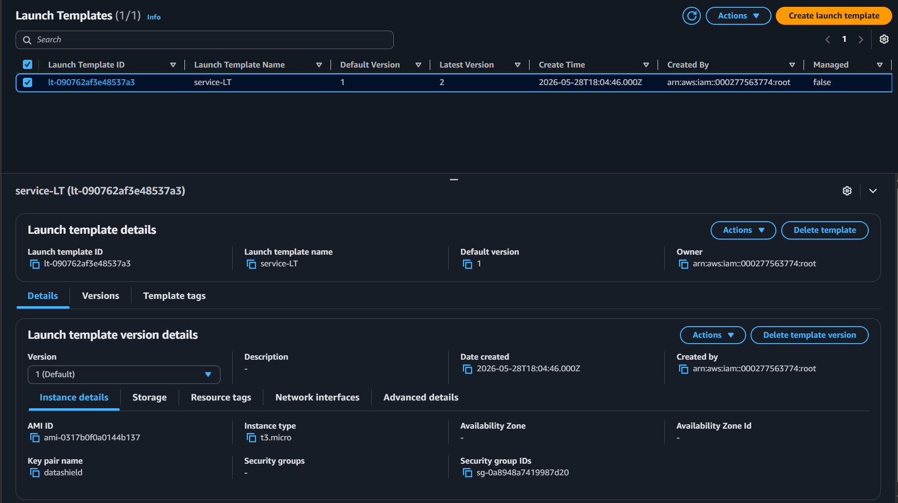

# Amazon EC2 Auto Scaling

## Overview

Amazon EC2 Auto Scaling automatically adjusts the number of EC2 instances based on application demand. In the DataShield platform, Auto Scaling ensures that the Collector Service remains highly available by automatically launching or terminating EC2 instances based on predefined scaling policies.

---

# Purpose in DataShield

The Auto Scaling Group (ASG) was implemented to:

- Maintain high availability
- Automatically replace unhealthy Collector instances
- Scale the application based on workload
- Reduce downtime
- Improve fault tolerance
- Integrate seamlessly with the Application Load Balancer (ALB)

---

# Why Auto Scaling?

Auto Scaling was selected because it provides:

- Automatic instance replacement
- Automatic scaling
- High availability
- Fault tolerance
- Better resource utilization
- Integration with ALB and CloudWatch

Without Auto Scaling, if the Collector EC2 instance failed, the application would become unavailable until a replacement was manually launched.

---

# Architecture

```
Internet
      │
      ▼
Application Load Balancer
      │
      ▼
Target Group
      │
      ▼
Auto Scaling Group
      │
 ┌────┴────┐
 │         │
Collector  Collector
EC2 #1     EC2 #2
```

---

# Auto Scaling Workflow

```
Client Request

↓

Application Load Balancer

↓

Target Group

↓

Auto Scaling Group

↓

Healthy Collector Instance
```

If a Collector instance fails:

```
Health Check Failed

↓

Target Group Marks Unhealthy

↓

Auto Scaling Detects Failure

↓

Launch Template Used

↓

New Collector EC2 Created

↓

Collector Service Starts

↓

Health Check Passes

↓

Traffic Resumes
```

---

# Launch Template

The Auto Scaling Group uses a Launch Template containing:

- Amazon Machine Image (AMI)
- Instance Type
- IAM Role
- Security Group
- Key Pair
- User Data Script
- Storage Configuration

Every new Collector instance launched by the ASG uses this template, ensuring identical configuration.

---

# Scaling Configuration

| Property | Value |
|----------|-------|
| Desired Capacity | 1 *(Update with your value)* |
| Minimum Capacity | 1 *(Update with your value)* |
| Maximum Capacity | 2 *(Update with your value)* |
| Health Check Type | EC2 + ALB |
| Launch Template | Collector Launch Template |

*(Replace the values above with your actual ASG configuration.)*

---

# Health Checks

The Auto Scaling Group uses:

- EC2 Health Checks
- ALB Health Checks

The Collector instance is considered healthy only if both checks pass.

Health Check Endpoint:

```
http://Collector:8080/health
```

---

# Integration

The Auto Scaling Group integrates with:

- Application Load Balancer
- Target Group
- Launch Template
- CloudWatch
- Security Groups
- IAM Roles

This enables automatic deployment and monitoring of new Collector instances.

---

# Security

Each newly launched Collector instance automatically receives:

- IAM Role
- Security Group
- Private Subnet placement
- Launch Template configuration

No manual configuration is required after launch.

---

# Advantages

- Automatic recovery
- High availability
- Reduced downtime
- Automatic scaling
- Consistent deployment
- Cost optimization
- AWS native integration

---

# Screenshots

## Auto Scaling Group



---

## Activity History



---

## Launch Template



---

# Why Auto Scaling Instead of Manual Scaling?

Without Auto Scaling:

```
Collector Fails

↓

Manual EC2 Launch

↓

Manual Configuration

↓

Manual Registration
```

With Auto Scaling:

```
Collector Fails

↓

Auto Scaling Detects Failure

↓

Launch Template

↓

New Collector Created

↓

Automatically Registered

↓

Application Restored
```

---

# Key Takeaways

Amazon EC2 Auto Scaling provides automatic recovery, scalability, and high availability for the DataShield platform. By integrating with the Application Load Balancer and Launch Template, it ensures that healthy Collector instances are always available to process incoming requests without requiring manual intervention.