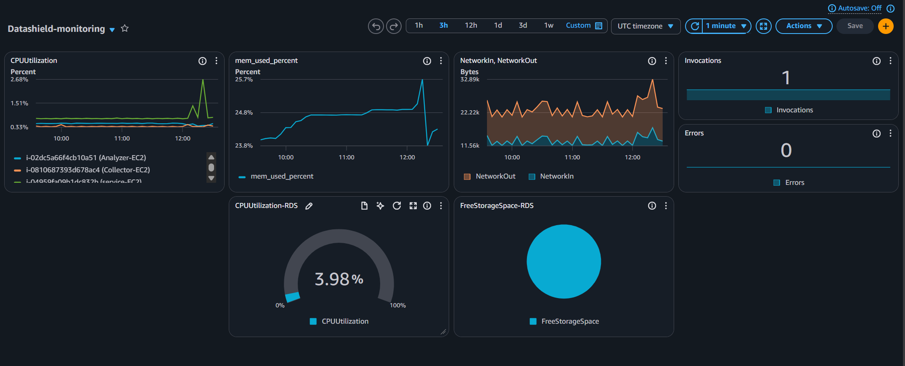
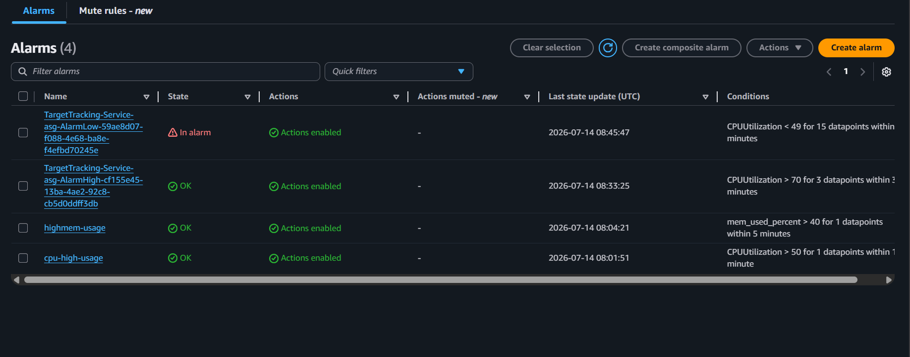

# Amazon CloudWatch

## Overview

Amazon CloudWatch is a monitoring and observability service that collects metrics, logs, and events from AWS resources. In the DataShield platform, CloudWatch is used to monitor EC2 instances, application performance, system health, and trigger notifications when predefined thresholds are exceeded.

---

# Purpose in DataShield

CloudWatch was implemented to:

- Monitor EC2 instance health
- Monitor CPU, memory, and disk utilization
- Collect application logs
- Monitor system performance
- Generate alarms
- Send notifications through Amazon SNS

---

# Components Used

| Component | Purpose |
|-----------|---------|
| CloudWatch Metrics | Monitor EC2 resource utilization |
| CloudWatch Logs | Store application and system logs |
| CloudWatch Agent | Collect memory, disk, and custom metrics |
| CloudWatch Alarms | Detect abnormal conditions |
| Amazon SNS | Send email notifications |

---

# Monitoring Architecture

```
Collector EC2
        │
Analyzer EC2
        │
Service EC2
        │
Archive EC2
        │
CloudWatch Agent
        │
        ▼
Amazon CloudWatch
        │
        ▼
CloudWatch Alarm
        │
        ▼
Amazon SNS
        │
        ▼
Email Notification
```

---

# Metrics Monitored

The following metrics are continuously monitored:

| Metric | Purpose |
|--------|---------|
| CPU Utilization | Detect high processor usage |
| Memory Utilization | Monitor RAM usage |
| Disk Utilization | Monitor storage consumption |
| Disk Read/Write | Storage performance |
| Network In/Out | Network traffic |
| EC2 Status Check | Instance health |

---

# CloudWatch Agent

The CloudWatch Agent was installed on the EC2 instances to collect system-level metrics that are not available by default.

Collected metrics include:

- Memory Usage
- Disk Usage
- Disk I/O
- Swap Usage
- Network Statistics

---

# Log Monitoring

CloudWatch stores logs from the DataShield services, making troubleshooting easier.

Monitored services include:

- Collector Service
- Analyzer Service
- Service Layer
- System Logs

Example:

```
Application Started

↓

Request Received

↓

Processing Completed

↓

File Uploaded to Amazon S3

↓

Metadata Stored in Amazon RDS
```

---

# CloudWatch Alarms

CloudWatch Alarms monitor resource utilization and automatically trigger notifications when thresholds are exceeded.

Example alarms:

| Alarm | Condition |
|--------|-----------|
| High CPU | CPU > 70% |
| High Memory | Memory > 80% |
| High Disk Usage | Disk > 80% |
| Instance Status Check | Failed |

---

# Amazon SNS Integration

When an alarm is triggered:

```
CloudWatch Alarm

↓

Amazon SNS

↓

Email Notification
```

This enables administrators to respond quickly to issues.

---

# Security

CloudWatch uses IAM Roles attached to EC2 instances.

Benefits:

- No AWS Access Keys stored on EC2
- Temporary credentials
- Secure communication
- Least Privilege access

---

# Screenshots

## CloudWatch Dashboard



---

## CloudWatch Alarm



---


# Advantages

- Real-time monitoring
- Centralized logging
- Automatic alerting
- Easy troubleshooting
- Performance analysis
- AWS native integration

---

# Key Takeaways

Amazon CloudWatch provides complete monitoring and observability for the DataShield platform. By collecting metrics, logs, and alarms from EC2 instances and integrating with Amazon SNS, CloudWatch enables proactive monitoring, faster troubleshooting, and improved operational reliability.