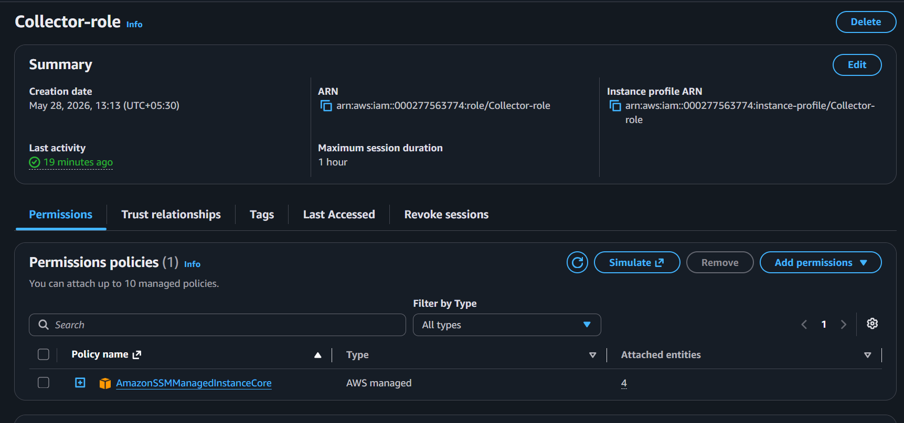
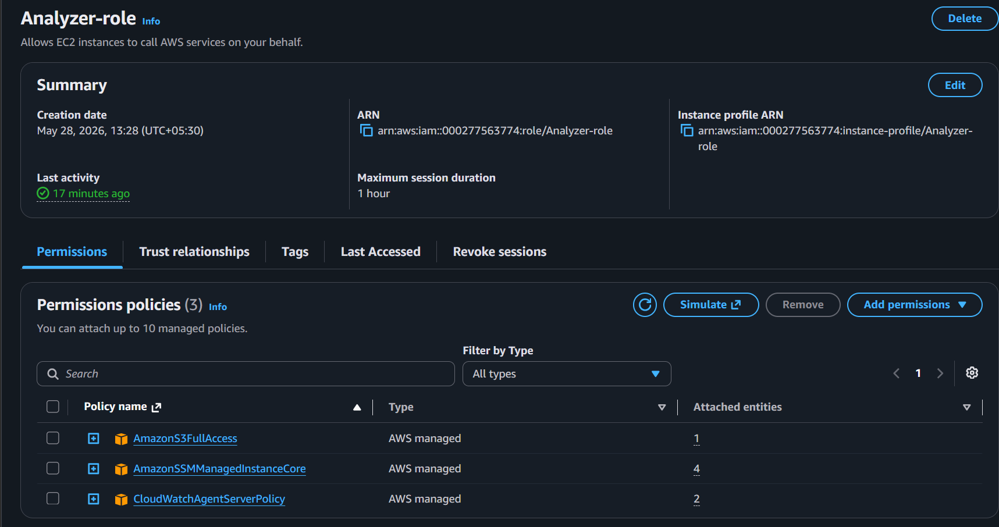
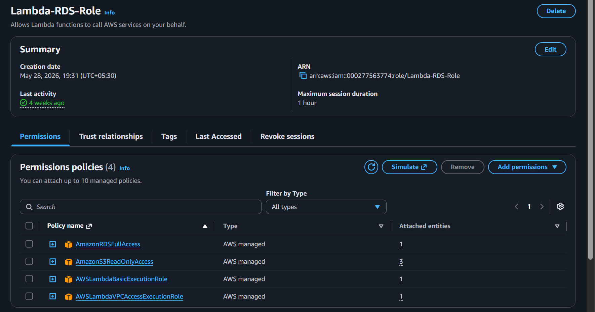
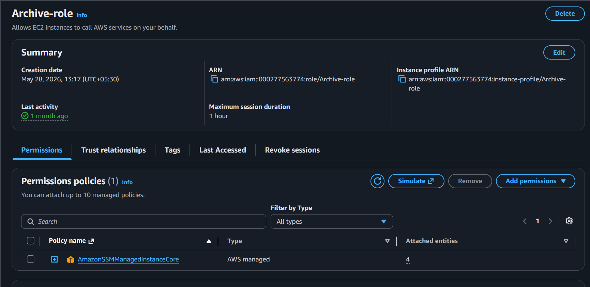

# AWS Identity and Access Management (IAM)

## Overview

AWS Identity and Access Management (IAM) is used to securely manage authentication and authorization for AWS resources. In the DataShield platform, IAM Roles provide temporary credentials that allow EC2 instances and Lambda functions to securely access AWS services without storing access keys.

---

## Purpose in DataShield

IAM was implemented to:

- Securely access AWS services
- Eliminate the need for hardcoded AWS credentials
- Apply the Principle of Least Privilege
- Manage permissions for EC2 instances and Lambda functions
- Improve overall security and maintainability

---

## IAM Roles Used

The following IAM Roles were created for the project:

| IAM Role | Attached To | Purpose |
|-----------|-------------|---------|
| Collector-role | Collector EC2 | AWS Systems Manager (SSM) access |
| Analyzer-role | Analyzer EC2 | Upload processed files to Amazon S3, CloudWatch Agent, SSM |
| Archive-role | Archive EC2 | AWS Systems Manager (SSM) access |
| Lambda-RDS-Role | AWS Lambda | Read from Amazon S3, write metadata to Amazon RDS, CloudWatch Logs |

---

## Instance Profiles

Each EC2 instance uses an Instance Profile to associate an IAM Role with the EC2 instance.

This allows applications running on the instance to automatically obtain temporary AWS credentials through the EC2 Instance Metadata Service (IMDS), eliminating the need to configure AWS access keys manually.

# Collector Role

## Purpose

The Collector Service only receives client requests, creates raw backups, and forwards data to the Analyzer. It does not directly access AWS services except through AWS Systems Manager.

### Attached Policy

- AmazonSSMManagedInstanceCore

### Why?

This policy allows:

- Session Manager access
- Instance management
- Secure remote administration without opening SSH ports

---

# Analyzer Role

## Purpose

The Analyzer processes incoming data and uploads processed files to Amazon S3.

### Attached Policies

- AmazonS3FullAccess
- AmazonSSMManagedInstanceCore
- CloudWatchAgentServerPolicy

### Why?

AmazonS3FullAccess

- Upload processed files to S3.

AmazonSSMManagedInstanceCore

- Secure remote management using Session Manager.

CloudWatchAgentServerPolicy

- Publish logs and metrics to Amazon CloudWatch.

---

# Archive Role

## Purpose

The Archive Server stores raw backup files using an encrypted LUKS volume and shares them through NFS.

### Attached Policy

- AmazonSSMManagedInstanceCore

### Why?

The Archive server does not interact with S3 or RDS. It only requires Systems Manager for secure administration.

---

# Lambda-RDS Role

## Purpose

The Lambda function is automatically triggered whenever a processed file is uploaded to Amazon S3.

It performs the following tasks:

- Reads the uploaded file
- Extracts metadata
- Stores metadata in Amazon RDS
- Writes execution logs to CloudWatch

### Attached Policies

- AWSLambdaBasicExecutionRole
- AWSLambdaVPCAccessExecutionRole
- AmazonS3ReadOnlyAccess
- AmazonRDSFullAccess

### Why?

AWSLambdaBasicExecutionRole

- Write logs to Amazon CloudWatch.

AWSLambdaVPCAccessExecutionRole

- Access Amazon RDS inside the VPC.

AmazonS3ReadOnlyAccess

- Read uploaded JSON files.

AmazonRDSFullAccess

- Insert metadata into the database.

---

## Why IAM Roles Instead of Access Keys?

IAM Roles were chosen because they:

- Provide temporary credentials
- Rotate credentials automatically
- Eliminate hardcoded secrets
- Improve security
- Follow AWS best practices

---

## Security Best Practices Followed

- No AWS Access Keys stored on EC2 instances
- IAM Roles attached directly to EC2 instances
- Least Privilege principle followed
- Separate IAM Role for each application component
- Lambda uses a dedicated execution role
- Permissions are separated by responsibility

---

## Screenshots

### Collector IAM Role

---

### Analyzer IAM Role

---

### Lambda IAM Role

---

### RDS IAM Role

---
### Service IAM Role

---

## Benefits

- Improved security
- Temporary credentials
- Fine-grained permission management
- Easy administration
- AWS recommended authentication mechanism

---

## Key Takeaways

IAM Roles form the security foundation of the DataShield platform by enabling secure communication between AWS services without exposing sensitive credentials. Each component receives only the permissions required to perform its specific function, following the Principle of Least Privilege.