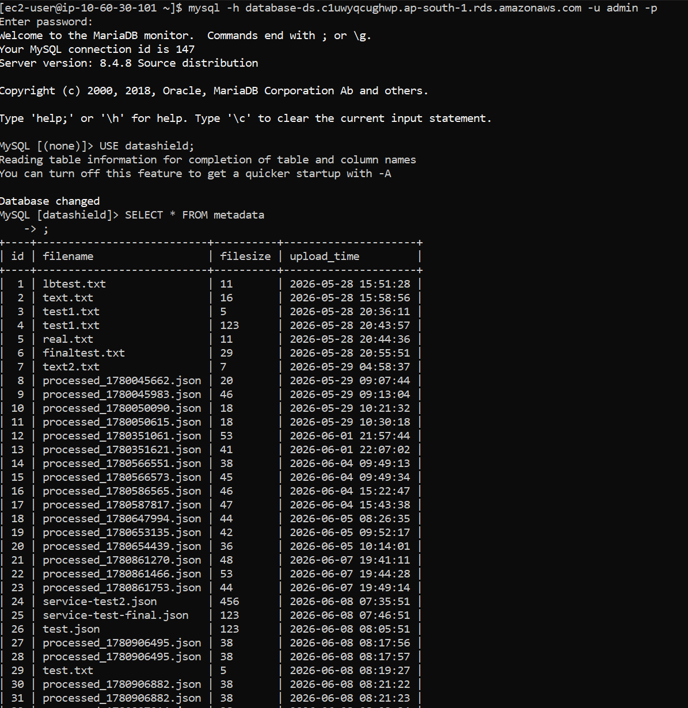

# Amazon Relational Database Service (Amazon RDS)

## Overview

Amazon Relational Database Service (Amazon RDS) is a fully managed relational database service provided by AWS. In the DataShield platform, Amazon RDS is used to store metadata generated after file processing, allowing the Service Layer to retrieve and display processed information through the dashboard.

---

# Purpose in DataShield

Amazon RDS serves as the centralized metadata repository.

It is responsible for:

- Storing metadata of processed files
- Maintaining structured relational data
- Providing persistent storage
- Supplying data to the dashboard
- Supporting future reporting and analytics

---

# Why Amazon RDS?

Amazon RDS was selected because it provides:

- Fully managed database administration
- Automatic backups
- High availability support
- Automatic software patching
- Secure VPC integration
- Easy scalability
- Reliable relational storage

Unlike storing metadata in JSON files or S3, a relational database enables efficient querying, filtering, sorting, and reporting.

---

# Database Engine

| Property | Value |
|----------|-------|
| Engine | MySQL |
| Deployment | Amazon RDS |
| Region | ap-south-1 |
| Accessibility | Private |
| Port | 3306 |

---

# Workflow

```
Client

↓

Collector

↓

Analyzer

↓

Amazon S3

↓

Lambda

↓

Amazon RDS

↓

Service Layer

↓

Dashboard
```

---

# Communication Flow

## Metadata Storage

1. Analyzer uploads processed JSON to Amazon S3.
2. Amazon S3 triggers AWS Lambda.
3. Lambda extracts metadata.
4. Lambda inserts metadata into Amazon RDS.
5. Service Layer retrieves metadata from RDS.
6. Dashboard displays the results.

---

# Database Schema

Example table:

**metadata**

| Column | Description |
|---------|-------------|
| id | Primary Key |
| filename | Processed file name |
| upload_time | Upload timestamp |
| file_size | File size |
| s3_key | Amazon S3 object path |
| status | Processing status |

*(Update this table to match your actual schema if the column names differ.)*

---

# Connectivity

Amazon RDS is deployed inside a **private subnet**.

Only authorized resources can access the database.

Authorized resources:

- Service EC2
- Lambda Function (through VPC)

No public internet access is allowed.

---

# Security

Security measures implemented:

- Private subnet deployment
- Dedicated RDS Security Group
- Port 3306 restricted
- IAM Roles used where applicable
- Encryption at rest (if enabled)
- Automatic backups (if enabled)

---

# Security Group Rules

| Source | Port |
|---------|------|
| Service Security Group | 3306 |
| Lambda (if inside VPC) | 3306 |

This ensures that only trusted application components can communicate with the database.

---

# Service Integration

The Service Layer connects to Amazon RDS using SQLAlchemy and PyMySQL.

Example:

```
Service

↓

SQLAlchemy

↓

PyMySQL

↓

Amazon RDS
```

This architecture separates business logic from database operations and simplifies future maintenance.

---

# Screenshots

## Amazon RDS Overview



---

# Advantages

- Fully managed service
- Automatic backups
- Easy maintenance
- Secure VPC deployment
- High availability options
- Scalable compute and storage
- Relational querying capabilities

---

# Key Takeaways

Amazon RDS provides reliable, secure, and fully managed relational storage for the DataShield platform. By storing metadata in a structured relational database, the application can efficiently retrieve, display, and manage processed file information while maintaining security through private networking and controlled access.