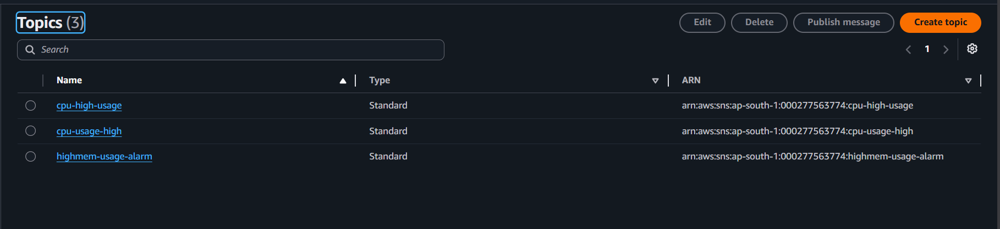
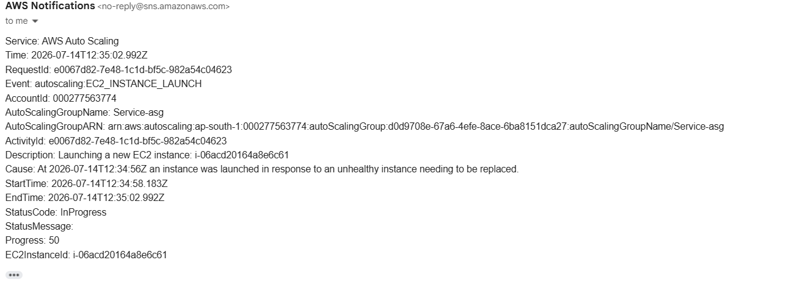

# Amazon Simple Notification Service (Amazon SNS)

## Overview

Amazon Simple Notification Service (Amazon SNS) is a fully managed messaging and notification service provided by AWS. In the DataShield platform, Amazon SNS is integrated with Amazon CloudWatch to send email notifications whenever a monitored resource exceeds predefined thresholds or an alarm is triggered.

---

# Purpose in DataShield

Amazon SNS was implemented to:

- Notify administrators about infrastructure issues
- Deliver CloudWatch alarm notifications
- Improve system monitoring
- Enable faster response to failures
- Provide centralized alert management

---

# Why Amazon SNS?

Amazon SNS was selected because it provides:

- Real-time notifications
- Multiple notification protocols
- Easy integration with CloudWatch
- Highly reliable message delivery
- Fully managed AWS service

---

# Workflow

```
EC2 Metrics

↓

CloudWatch

↓

CloudWatch Alarm

↓

Amazon SNS Topic

↓

Email Notification

↓

Administrator
```

---

# Components Used

| Component | Purpose |
|-----------|---------|
| SNS Topic | Receives notifications from CloudWatch |
| Email Subscription | Delivers notifications to administrator |
| CloudWatch Alarm | Publishes messages to SNS |

---

# Notification Flow

### Step 1

CloudWatch continuously monitors EC2 metrics.

↓

### Step 2

If a threshold is exceeded, CloudWatch changes the alarm state.

↓

### Step 3

The CloudWatch Alarm publishes a message to the SNS Topic.

↓

### Step 4

Amazon SNS sends an email notification to all subscribed recipients.

---

# Notifications

The following events can generate notifications:

- High CPU Utilization
- High Memory Usage
- High Disk Usage
- EC2 Status Check Failure
- Custom CloudWatch Alarms

---

# Topic Configuration

| Property | Value |
|----------|-------|
| Type | Standard Topic |
| Protocol | Email |
| Subscriber | Administrator Email |

---

# Security

SNS security is implemented using:

- IAM permissions
- CloudWatch integration
- Email subscription confirmation
- AWS managed infrastructure

Only authorized AWS services are allowed to publish messages to the configured SNS Topic.

---

# Integration with CloudWatch

CloudWatch Alarm

↓

Amazon SNS Topic

↓

Email Notification

↓

Administrator

This integration enables automatic alerting without requiring manual monitoring.

---

# Screenshots

## Subscription



---

## Email Confirmation



---


# Advantages

- Real-time notifications
- Automatic alert delivery
- Easy CloudWatch integration
- Highly reliable messaging
- Simple configuration
- Fully managed service

---

# Key Takeaways

Amazon SNS enables proactive monitoring in the DataShield platform by delivering real-time notifications whenever CloudWatch detects abnormal system behavior. This allows administrators to respond quickly to infrastructure issues, improving system reliability and operational efficiency.