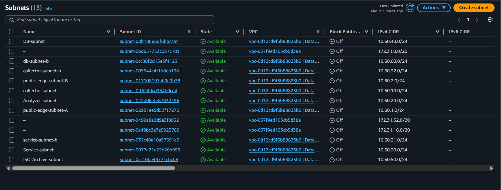
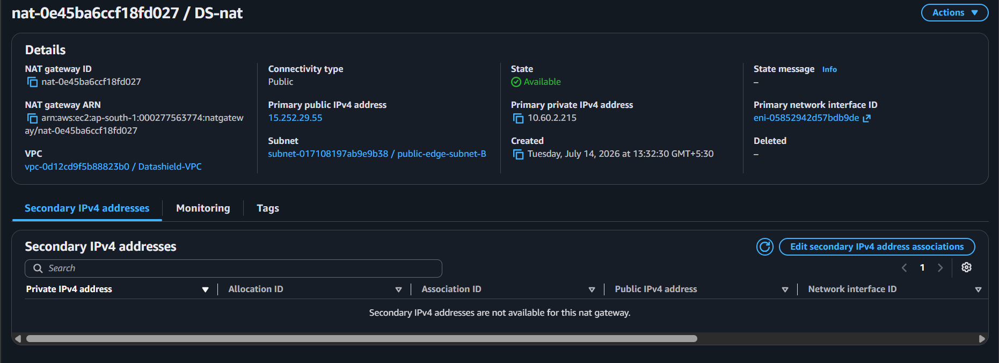
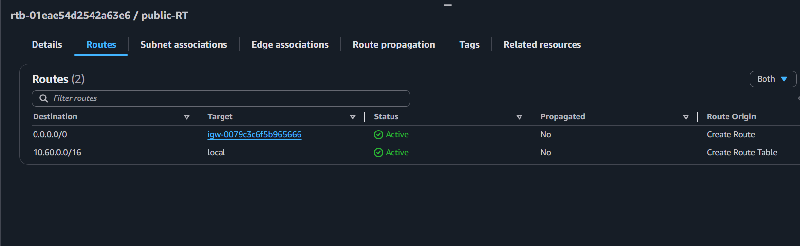
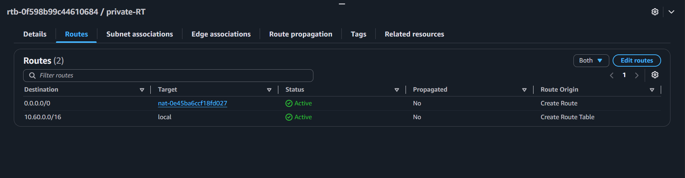
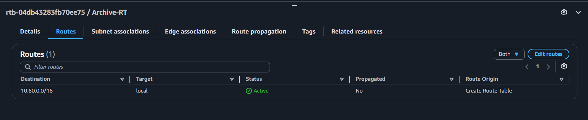
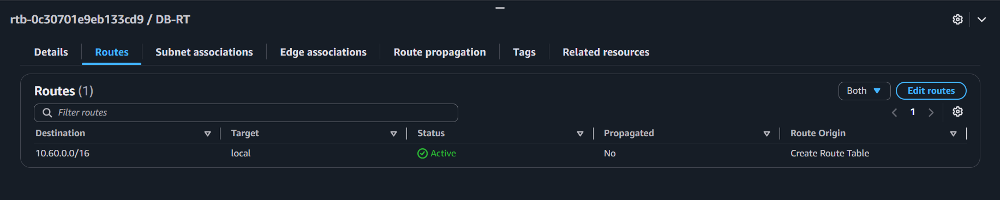

# Amazon Subnets

## Overview

Amazon Subnets divide the Virtual Private Cloud (VPC) into smaller network segments. In the DataShield platform, subnets are used to separate internet-facing resources from internal application and database resources, improving security, organization, and scalability.

---

## Purpose in DataShield

The subnet architecture was designed to:

- Separate public and private resources
- Improve network security
- Restrict direct internet access to backend services
- Support scalable and organized infrastructure
- Enable secure communication between application components

---

## Subnet Architecture

The DataShield VPC contains the following subnets:

| Subnet | Type | Purpose |
|---------|------|---------|
| Public Subnet | Public | Bastion Host, NAT Gateway, Application Load Balancer |
| Collector Subnet | Private | Collector Service |
| Analyzer Subnet | Private | Analyzer Service |
| Service Subnet | Private | Dashboard / Service Layer |
| Archive Subnet | Private | Archive Server |
| Database Subnet | Private | Amazon RDS |

---

## Public Subnet

### Purpose

The public subnet hosts resources that require internet connectivity.

Resources deployed:

- Bastion Host
- NAT Gateway
- Application Load Balancer

### Why Public?

These resources must either:

- Receive internet traffic
- Provide internet access for private instances
- Allow administrators to securely connect to private instances

---

## Private Subnets

### Purpose

Private subnets host backend application components that should not be directly accessible from the internet.

Resources deployed:

- Collector Service
- Analyzer Service
- Service Layer
- Archive Server
- Amazon RDS

### Why Private?

Keeping backend resources in private subnets:

- Improves security
- Prevents direct public access
- Forces communication through controlled endpoints
- Reduces attack surface

---

# NAT Gateway

## Purpose

The NAT Gateway provides outbound internet access to resources deployed in private subnets while preventing inbound internet connections.

In the DataShield platform, the NAT Gateway allows the following instances to securely access the internet:

- Collector EC2
- Analyzer EC2
- Service EC2
- Archive EC2

This enables them to:

- Install software packages
- Download updates
- Access AWS services
- Send CloudWatch metrics
- Upload files to Amazon S3

without exposing the instances to the public internet.

### Traffic Flow

```
Private EC2

↓

Private Route Table

↓

NAT Gateway

↓

Internet Gateway

↓

Internet

```

# Route Tables

Route Tables determine how network traffic is routed within the DataShield VPC. Four Route Tables were configured to separate public access from different private application tiers.

---

## 1. Public Route Table

**Associated Subnets**

- Public Subnet

### Routes

| Destination | Target |
|-------------|--------|
| 10.60.0.0/16 | local |
| 0.0.0.0/0 | Internet Gateway |

### Purpose

Provides internet connectivity for:

- Application Load Balancer
- Bastion Host
- NAT Gateway

---

## 2. Private Route Table

**Associated Subnets**

- Collector Subnet
- Analyzer Subnet
- Service Subnet

### Routes

| Destination | Target |
|-------------|--------|
| 10.60.0.0/16 | local |
| 0.0.0.0/0 | NAT Gateway |

### Purpose

Allows backend application servers to access the internet for software updates and AWS services while remaining inaccessible from the public internet.

---

## 3. Archive Route Table

**Associated Subnet**

- Archive Subnet

### Routes

| Destination | Target |
|-------------|--------|
| 10.60.0.0/16 | local |
| 0.0.0.0/0 | NAT Gateway |

### Purpose

Provides secure outbound internet access for the Archive server while allowing it to remain isolated in a private subnet.

---

## 4. Database Route Table

**Associated Subnet**

- Amazon RDS Subnet

### Routes

| Destination | Target |
|-------------|--------|
| 10.60.0.0/16 | local |

### Purpose

The database subnet remains completely private. It communicates only within the VPC and has no direct route to the internet.

---

## Communication Flow

```
Internet
    │
    ▼
Application Load Balancer
    │
    ▼
Collector
    │
    ▼
Analyzer
    │
    ├────────► Amazon S3
    │
    ▼
Service Layer
    │
    ▼
Amazon RDS

Archive Server communicates internally through private networking.
```

---

## Screenshot

### Subnets Overview





## Public Route Table



---

## Private Route Table



---

## Archive Route Table



---

## Database Route Table



---

## Benefits

- Improved network isolation
- Better security
- Easier infrastructure management
- Supports future scalability
- Follows AWS best practices

---

## Best Practices Followed

- Internet-facing resources deployed only in public subnets
- Backend services deployed only in private subnets
- Database isolated in a private subnet
- Communication performed through private IP addresses whenever possible
- Network traffic controlled using Route Tables and Security Groups

---

## Key Takeaways

Separating resources into public and private subnets improves the security and reliability of the DataShield platform by ensuring that only the required components are exposed to the internet while protecting backend services and sensitive data.